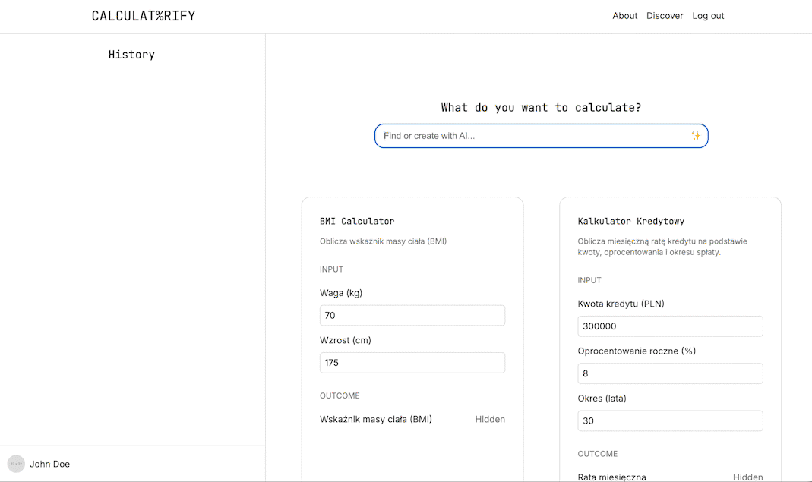

# Calculatorify



Calculatorify is a project that allows you to turn any idea into a fully functional calculator using AI prompts. Simply describe what you want to calculate—whether it's body mass index, loan repayment, or any custom formula—and our AI will generate the necessary logic and user interface for you in seconds.

Built with user authentication and history tracking, Calculatorify makes it easy to build, discover, and share calculators created by you and the community.

## Architecture

Calculatorify consists of three main components:

- **Backend (Java)**
  - HTTP server using `com.sun.net.httpserver`
  - PostgreSQL database with Flyway migrations
  - Endpoints:
    - `POST /register`, `POST /login`, `POST /logout`
    - `GET /calculators`, `GET /calculators/{id}`
    - `POST /calculators` (create), `PUT /calculators/{id}` (update), `DELETE /calculators/{id}`
    - `POST /calculators/construct` (AI-assisted generation)
    - `GET /history` (user access history)
  - Services: se
  - ssion management, history, calculator logic, notation parser, AI request forwarding

- **AI Backend (Python)**
  - FastAPI server forwarding requests to OpenAI
  - Endpoint: `POST /chat`
  - Configuration via `.env` (`OPENAI_API_KEY`)

- **Frontend (TypeScript & Sass)**
  - Components: Dashboard, Modify page, History sidebar, Navigation
  - Build tools: TypeScript compiler, Sass, Live Server
  - Pages: `dashboard.html`, `modify.html`, `about.html`

## Prerequisites

- Docker & Docker Compose
- Java 17 & Maven (for backend)
- Node.js & npm (for frontend)
- Python 3.12 & Poetry (for AI backend)

## Local Development

1. **Configure AI backend**
   ```bash
   cd backend-ai
   cp .env.example .env
   # set OPENAI_API_KEY in .env
   ```

2. **Start services**
   ```bash
   docker-compose -f docker-compose-local.yaml up --build
   ```
   This will start PostgreSQL on port `5433`, the AI backend on `8000`, and the Java backend on `8080`.

3. **Run frontend**
   ```bash
   cd frontend
   npm install
   npm run dev
   ```
   Live Server will serve the `public` directory on an available port (e.g. `8081`). Open `<PORT>/dashboard.html` in your browser.

4. **Use the app**
   - Register and log in
   - Discover or create calculators via the dashboard
   - Modify calculators and view your access history

## Configuration

### Java Backend
- `BACKEND_AI_URL` (default: `http://localhost:8000`)
- `BACKEND_AI_SYSTEM_MESSAGE` (override the AI system prompt)

### AI Backend
- In `backend-ai/.env`:
  ```dotenv
  OPENAI_API_KEY=your_openai_api_key
  ```

## API Reference

### Authentication
- `POST /register`
- `POST /login`
- `POST /logout`

### Calculators
- `GET /calculators?q=<search>`
- `GET /calculators/{id}`
- `POST /calculators`
- `PUT /calculators/{id}`
- `DELETE /calculators/{id}`
- `POST /calculators/construct`

### History
- `GET /history`

## Running Tests
- **Java backend**: `cd backend && mvn test`

## Contributing
Contributions, issues, and feature requests are welcome. Please open an issue or pull request on GitHub.
